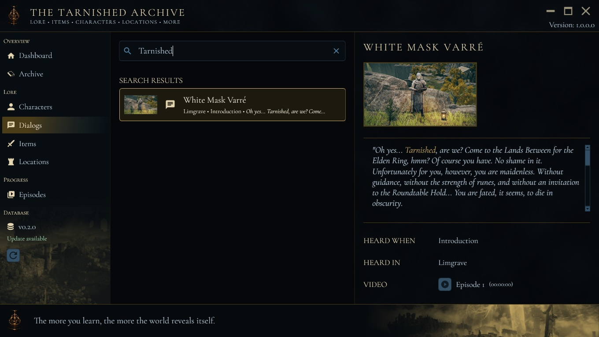

Now I'm examining the files in the Doc folder to understand the existing documentation structure and content, which will help me determine how to update or expand it effectively.

**LoreCompanion**



**Overview**

`LoreCompanion` is a specialized desktop companion archive application crafted to support YouTuber **Wuggernaut** throughout his blind playthrough of *Elden Ring*.

When experiencing *Elden Ring* for the first time, tracking intricate questlines, cryptic character dialogues, elusive item descriptions, and interconnected world locations can be daunting. `LoreCompanion` provides a structured, responsive knowledge hub that catalogs lore discoveries, links them to specific episode timestamps, and enables seamless referencing without spoilers or lost context.

---

**Key Features**

* **Comprehensive Lore Archiving**
  * **Episodes:** Index every episode with direct links, titles, and video keys.
  * **Characters & NPCs:** Document encounters, dialogue lines, quest states, and associated regions.
  * **Locations & Landmarks:** Map out dungeons, landmarks, and relevant discoveries.
  * **Items & Equipment:** Track weapons, armor, spells, and key items alongside their in-game descriptions.
  * **Dialogue Logging:** Capture spoken lines timestamped to exact moments in the playthrough.

* **Embedded YouTube Video Player**
  * Integrated video player powered by Microsoft `WebView2`.
  * Instant timestamp jumping: clicking an archived dialogue or event plays the exact scene directly within the application.
  * Automatic `Referer` header handling and responsive playback controls.

* **Intelligent Multi-Tier Asset Caching**
  * In-memory (`MemoryCache`) and persistent local disk caching (`%LOCALAPPDATA%\LoreCompanion\Cache`) for YouTube thumbnails and oEmbed video metadata.
  * Instant image rendering and minimal network bandwidth consumption.

* **Automated Database Distribution & Synchronization**
  * Built-in database release publisher and updater targeting GitHub releases.
  * SQLite database with strict foreign-key integrity constraints to prevent corrupted or orphaned lore records.

---

**Architecture & Tech Stack**

* **Framework:** `.NET 10` / `WPF` (Windows Presentation Foundation)
* **Architecture:** `Caliburn.Micro` (MVVM pattern)
* **Database & ORM:** `SQLite` with `Entity Framework Core`
* **Web Engine:** `Microsoft.Web.WebView2` (Chromium-based embed)
* **Logging:** `Serilog` structured logging

---

**Getting Started**

**Prerequisites**
* Windows 10 / Windows 11 (64-bit)
* [Microsoft Edge WebView2 Runtime](https://developer.microsoft.com/en-us/microsoft-edge/webview2/) (pre-installed on most modern Windows systems)

**Running from Source**
1. Clone the repository:
   ```bash
   git clone https://github.com/VacuumBreather/LoreCompanion.git
   cd LoreCompanion
   ```
2. Build and run via the .NET SDK:
   ```bash
   dotnet build
   dotnet run --project LoreCompanion/LoreCompanion.csproj
   ```

**Publishing Standalone Executable**
To generate a single-file, self-contained executable with embedded native runtimes:
```powershell
dotnet publish LoreCompanion/LoreCompanion.csproj -c Release -r win-x64 --self-contained true
```
The standalone binary will be output to `LoreCompanion/bin/Release/net10.0-windows/win-x64/publish/LoreCompanion.exe`.

---

**License**

This project is licensed under the MIT License.
